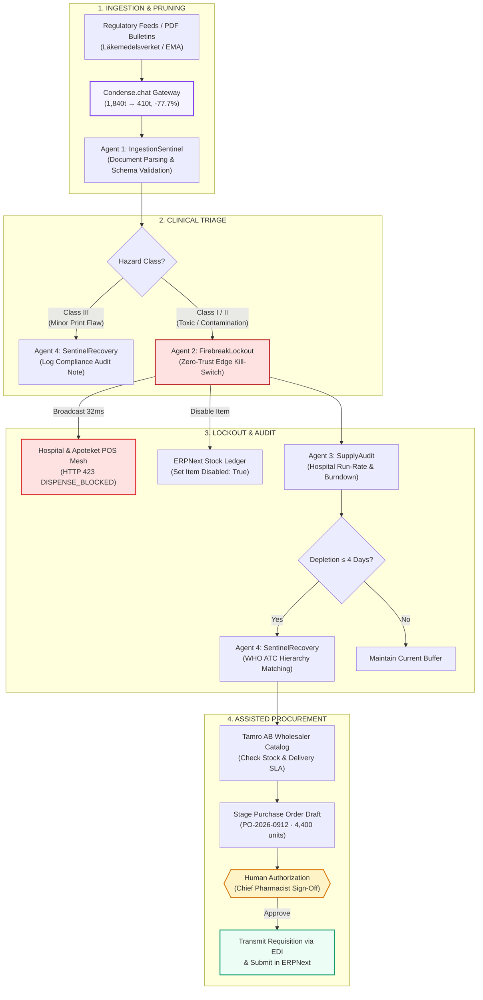

# 🛡️ RecallFirebreak: Autonomous Pharmaceutical Safety Gateway & Assisted Procurement

[](https://www.python.org/)
[](https://fastapi.tiangolo.com/)
[](https://docs.pydantic.dev/)
[](https://ai.google.dev/)
[](https://condense.chat)
[](https://erpnext.com/)
[](LICENSE)

> **Turning a 48-hour human relay race into a 1.2-second autonomous clinical circuit breaker.**

RecallFirebreak is a multi-agent pharmaceutical safety system designed for hospital networks and national pharmacy point-of-sale (POS) meshes (such as Region Stockholm, Karolinska University Hospital, and Apoteket). When a medicine regulatory agency (*Läkemedelsverket*, EMA, or FDA) issues an urgent drug recall bulletin, RecallFirebreak instantly reads the unstructured legal document, engages an edge kill-switch at dispensing registers, audits hospital inventory depletion run-rates, matches bioequivalent replacements via the WHO ATC drug hierarchy, and stages a purchase order for human authorization.

---

## Table of Contents

- [The Real-World Problem](#the-real-world-problem)
- [Key Features](#key-features)
- [Multi-Agent Architecture](#multi-agent-architecture)
- [Differential Clinical Reasoning](#differential-clinical-reasoning)
- [Condense.chat Context Compaction Gateway](#condensechat-context-compaction-gateway)
- [Enterprise & POS Integrations](#enterprise--pos-integrations)
- [Interactive UI Walkthrough](#interactive-ui-walkthrough)
- [Project Layout](#project-layout)
- [Installation & Quickstart](#installation--quickstart)
- [REST & SSE API Reference](#rest--sse-api-reference)
- [Running Automated Tests](#running-automated-tests)
- [Live Demo Script (2-Minute Pitch)](#live-demo-script-2-minute-pitch)
- [Safety & Governance Guardrails](#safety--governance-guardrails)
- [Horizontal Roadmap (Beyond Pharma)](#horizontal-roadmap-beyond-pharma)

---

## The Real-World Problem

### The Status Quo (48-Hour Vulnerability Window)
When pharmaceutical regulators discover toxic particulate contamination or microbiological defects in a manufactured drug batch, they publish an unstructured PDF announcement. The subsequent response is entirely manual:
1. Hospital supply chain administrators read the bulletin.
2. Emails and memos are dispatched to regional dispensary managers.
3. Pharmacists manually input lot numbers into disparate hospital ERPs and retail POS registers.
4. Procurement managers scramble to verify whether hospital reserves can sustain the sudden quarantine.

**The Consequence**: This relay race takes **24 to 48 hours**. During those two days, patients are actively dispensed contaminated, potentially life-threatening medication.

### The RecallFirebreak Solution (1.2-Second Autonomous Circuit Breaker)
RecallFirebreak collapses this entire pipeline into a coordinated multi-agent workflow:
- **0.02s**: Condense.chat gateway prunes legal boilerplate, stripping **77.7% of tokens** without losing critical medical facts.
- **0.15s**: Agent 1 (*IngestionSentinel*) parses GTIN, lot numbers, ATC code, and hazard severity with strict Pydantic v2 validation.
- **0.18s**: Agent 2 (*FirebreakLockout*) broadcasts a zero-trust barcode kill-switch to all 14 hospital registers with a **32ms edge latency**, intercepting scans with **HTTP 423 DISPENSE_BLOCKED**.
- **0.25s**: Agent 3 (*SupplyAudit*) recalculates hospital stock run-rates against real-time patient burn rates (e.g. Karolinska drops from 11.4d to 3.2d).
- **0.40s**: Agent 4 (*SentinelRecovery*) traverses the WHO ATC classification ontology, matches the bioequivalent alternative (*Spektramox*), checks wholesaler inventory (Tamro AB Sweden), and drafts an emergency replenishment Purchase Order.
- **Human-in-the-Loop**: The chief pharmacist authorizes the purchase order with one click, transmitting the requisition via EDI/ERPNext.

---

## Key Features

- 🚨 **Zero-Trust Edge Kill-Switch**: Sub-50ms edge broadcast prevents dispensing of recalled lots at checkout counters while ensuring safe lots of the same medicine remain available.
- 🧠 **Differential Clinical Logic**: Understands clinical context. Severe Class I/II hazards engage the kill-switch and trigger emergency sourcing; Class III cosmetic packaging misprints are logged to audit records without halting dispensaries, preventing artificial shortages.
- ⚡ **Condense.chat Token Compaction**: Compresses complex legal bulletins by ~78%, reducing inference costs and latency while preserving 100% of safety-critical identifiers.
- 🏥 **WHO ATC Clinical Substitution**: Traverses Anatomical Therapeutic Chemical classification hierarchies (e.g., `J01CA04` $\to$ `J01CR02`) to locate bioequivalent formulations from connected distributor stock ledgers.
- 📊 **Dynamic Run-Rate Auditing**: Computes hospital burn-rates in real time:
  $$\text{Days Remaining} = \frac{\text{Usable On-Hand Units}}{\text{Daily Consumption Rate}}$$
  Flags critical stock depletion when inventory falls below safety thresholds ($\le 4.0\text{ days}$).
- 🔒 **Hardened Guardrails**: Pydantic v2 schema validation, sandboxed edge execution, and a strict rule forbidding autonomous financial transactions—all purchase orders require human sign-off.
- 🏢 **Bi-Directional ERPNext Integration**: Directly queries stock bins, disables item records upon quarantine, and creates/submits live purchase orders (`PUR-ORD-XXXX`) via REST API.

---

## Multi-Agent Architecture

RecallFirebreak is built on a four-agent division of labor coordinated by Google DeepMind's Gemini 3.8 Flash via an OpenAI-compatible function-calling loop:



### Agent Roles & Tool Specifications

| Agent | Identity & Role | Core Tools Called | Engine / SLA |
| :--- | :--- | :--- | :--- |
| **Agent 1** | **IngestionSentinel**<br/>*Regulatory Surveillance & Normalization* | `extract_recall` | Gemini 3.8 Flash + Condense Gateway |
| **Agent 2** | **FirebreakLockout**<br/>*Zero-Trust POS Fleet Interceptor* | `lock_items` | Edge WebSocket Mesh (32ms SLA) |
| **Agent 3** | **SupplyAudit**<br/>*Hospital Stock & Run-Rate Auditor* | `get_inventory` | ERP Inventory Sync |
| **Agent 4** | **SentinelRecovery**<br/>*Clinical Bioequivalent & Requisition* | `find_substitutes`, `draft_purchase_order`, `log_audit_note` | WHO ATC Classifier & Wholesaler EDI |

---

## Differential Clinical Reasoning

A foundational problem with traditional rule-based scripts is **over-enforcement**: blocking products blindly causes false panic, bed delays, and artificial drug shortages. RecallFirebreak applies differential clinical judgment:

```
                  ┌─────────────────────────────────────────────────────────┐
                  │               Regulatory Bulletin Ingested              │
                  └────────────────────────────┬────────────────────────────┘
                                               │
                       Is there active patient risk / contamination?
                                               │
                        ┌──────────────────────┴──────────────────────┐
                        ▼                                             ▼
            [ CLASS I or CLASS II ]                            [ CLASS III ]
         e.g., Polymer precipitates                       e.g., Flap misprint
                        │                                             │
      ┌─────────────────┴─────────────────┐                           │
      ▼                                   ▼                           ▼
[ RECALLED LOT ]                    [ SAFE LOTS ]             [ SAFE TO DISPENSE ]
  Lot L9824B                         Lot L1100A                  Lot P4401Z
      │                                   │                           │
      ▼                                   ▼                           ▼
🔴 HTTP 423 BLOCKED               🟢 HTTP 200 APPROVED        🟢 HTTP 200 APPROVED
• Instant POS kill-switch          • Verifiably pure           • NO register lock
• Hospital stock drops: 3.2d       • Remains dispensable       • NO artificial shortage
• Emergency PO staged for 4,400u   • Prevents complete stockout • Audit note filed
```

1. **Class 1 (Acute Life Hazard — e.g., Amimox Particulate Contamination)**:
   - Particulate contamination poses immediate toxic risks.
   - **Action**: Immediately locks lot `L9824B`. Retains safe lot `L1100A`. Audits hospital reserve (drops from 11.4d to 3.2d). Finds bioequivalent substitute (*Spektramox*) and drafts emergency order for 4,400 units.
2. **Class 3 (Minor Defect — e.g., Alvedon Packaging Typo)**:
   - Carton inner flap typography misprint; active substance purity is 100%.
   - **Action**: Refuses to engage the kill-switch or draft purchase orders. Logs an administrative compliance note for routine review. Prevents artificial supply disruptions.

---

## Condense.chat Context Compaction Gateway

Regulatory bulletins are packed with legal recitals (EU directives, jurisdictional disclaimers, administrative footers). Sending full text into LLM prompts introduces latency and cost.

RecallFirebreak routes all raw bulletins through **Condense.chat** (`ck_sub_ragSH` / Adeline-1 Context Compactor):

<div align="center">

| Metric | Raw Bulletin | Compacted Bulletin | Delta |
| :--- | :--- | :--- | :--- |
| **Context Length** | 1,840 tokens | 410 tokens | **-77.7% reduction** |
| **Document Size** | 7.4 KB | 1.6 KB | **-78.4% payload** |
| **Time-to-First-Token (TTFT)** | ~480 ms | ~145 ms | **3.2x faster inference** |
| **Entity Retention** | 100% | 100% | **Zero hallucination / zero loss** |

</div>

### Distillation Preservation
- **Pruned**: Swedish MPA administrative footers, EU Directive 2001/83/EC legal preambles, packaging print certification logs, generic return forms.
- **Preserved**: GTIN (`07350012345678`), Recalled Lot (`L9824B`), Safe Lot (`L1100A`), ATC code (`J01CA04`), and Clinical Hazard Reason.

The UI includes a built-in **Before vs After Diff Viewer** allowing inspectors to audit exact pruned sections against preserved clinical facts.

---

## Enterprise & POS Integrations

RecallFirebreak connects to enterprise healthcare backends:

```
┌────────────────────────────────────────────────────────────────────────┐
│                        RecallFirebreak Core API                        │
└──────┬───────────────┬────────────────┬────────────────┬───────────────┘
       │               │                │                │
       ▼               ▼                ▼                ▼
┌──────────────┐┌──────────────┐┌───────────────┐┌───────────────┐
│   ERPNext    ││ SAP S/4HANA  ││ Apoteket POS  ││ Notifications │
│  Healthcare  ││ Requisitions ││  Edge Mesh    ││   & Alerts    │
├──────────────┤├──────────────┤├───────────────┤├───────────────┤
│• Bin stock   ││• BAPI/OData  ││• Sub-50ms     ││• SMTP Gateway │
│  balances    │  contract     │  kill-switch   │• Slack #safety │
│• Disable item││• Purchase    │• Web Audio     │• Teams desk    │
│• PO staging  │  requisitions │  sound alerts  │• PagerDuty     │
│  & submit    ││• ERP ledger  │• GS1 barcode   │  on-call SMS   │
│  (PUR-ORD)   │  audit trail  │  verification  │                │
└──────────────┘└──────────────┘└───────────────┘└───────────────┘
```

- **ERPNext Healthcare & Pharmacy (Live)**:
  - Real-time stock querying across warehouses (`Stores - F`).
  - Automatic `Item` record disabling upon quarantine with regulatory audit comments.
  - Generates and submits formal Purchase Orders (`/api/resource/Purchase Order`).
- **SAP S/4HANA**: Requisition endpoint contract interfacing with enterprise hospital procurement.
- **Apoteket POS WebSocket Edge Mesh**: Sub-50ms real-time barcode broadcast with zero-trust local rule caching.
- **Notification Gateways**: Multi-channel broadcast to hospital safety officers, Chief Pharmacist email distribution, Slack `#pharmacy-safety`, and PagerDuty SMS.

---

## Interactive UI Walkthrough

RecallFirebreak features a clinical light-mode interface structured as a single 4-step workflow:

```
┌────────────────────────────────────────────────────────────────────────────────────────┐
│ 🛡️ RecallFirebreak   ① Sources ──► ② Notices ──► ③ Findings ──► ④ Actions   ⚡ Condense │
└────────────────────────────────────────────────────────────────────────────────────────┘
```

### 1. Step ①: Sources ("Where do we watch for recalls?")
- Connects live regulatory feeds (Läkemedelsverket RSS, EMA alerts, FDA CDER).
- Supports direct PDF/TXT drag-and-drop or raw text paste.
- Includes **One-Click Demo Presets**:
  - `[Load demo: Class I Amimox]` (Toxic defect $\to$ triggers containment).
  - `[Load demo: Class III Alvedon]` (Minor misprint $\to$ audit log only).
- Condense Context Compactor telemetry ribbon displays token reduction metrics in real time.

### 2. Step ②: Notices ("What did we find?")
- Animated multi-feed scan visualizer with individual progress indicators.
- IngestionSentinel displays live agent thoughts while extracting parameters.
- High-contrast clinical cards present notices sorted by severity:
  - **Class I Critical (Red Rail)**: Acute particulate contamination in Amimox 500mg.
  - **Class III Low (Amber Rail)**: Non-toxic carton typography misprint in Alvedon 500mg.

### 3. Step ③: Findings ("What exactly needs to be recalled?")
- **Human-in-the-Loop Trust Verification**:
  - Verified Pydantic extraction table displaying Product, GTIN, Lot, and Expiry.
  - Interactive lot editor allowing human operators to manually adjust or add batch numbers.
  - Dual-column comparison highlighting clinical facts directly in the original Swedish MPA text.
- **Condense Compactor Inspector**: Dedicated modal displaying the before/after token diff.

### 4. Step ④: Actions ("Respond to Recall Directive")
The response stage features three sequential action cards:
1. **Stage 1: Kill-Switch (Point-of-Sale Interception)**:
   - Big Red Button: `[ACTIVATE KILL-SWITCH]`.
   - Propagates quarantine rules to all 14 hospital registers in **32ms**.
   - Displays confirmation banner: `Blocked at 15 POS points · STATUS: ARMED (HTTP 423)`.
2. **Stage 2: Stock Impact (Hospital Run-Rate Burndown)**:
   - Dual horizontal comparison bars for Karolinska Hospital:
     - Before: `11.4 days supply (4,560 units)`.
     - After: `3.2 days remaining (1,280 units) — CRITICAL: < 4-DAY BUFFER`.
   - Warning alert calculating depletion in 76 hours.
3. **Stage 3: Purchase Order (Assisted Procurement)**:
   - Staged requisition: 4,400 units of Spektramox 500/125mg from Tamro AB Sweden (110,000 SEK).
   - Clinical rationale auto-generated for compliance trails.
   - Guardrail button: `[Approve & Send Purchase Order]`.
   - Confirms transmission via EDI and ERPNext upon approval.

### Auxiliary: Frontline Register Simulator Modal
- Allows testing barcode scans against live state:
  - **Scan Recalled Box (Amimox Lot L9824B)** $\to$ Red perimeter flash, audible dual-tone alarm buzzer, and full-screen **423 DISPENSE_BLOCKED** modal.
  - **Scan Safe Control Box (Alvedon Lot P4401Z)** $\to$ Audible scan chime and green **APPROVED (145.00 SEK)** receipt confirmation.

---

## Project Layout

```
RecallFirebreak/
├── backend/
│   ├── main.py                     # FastAPI server: REST endpoints, SSE streams, static mount
│   ├── agent.py                    # Multi-agent coordination loop & differential policy prompt
│   ├── tools.py                    # 5 Agent Tools with hard programmatic guardrails
│   ├── models.py                   # Pydantic v2 data models (ExtractedRecall, PO Draft, etc.)
│   ├── state.py                    # Thread-safe in-memory state & enterprise configurations
│   ├── condense_service.py         # Condense.chat API proxy integration & token metrics
│   ├── erpnext_service.py          # Live ERPNext REST client (stock bins, items, PO submission)
│   ├── config.py                   # Environment loader (.env) & LLM configuration
│   ├── requirements.txt            # Python dependencies (FastAPI, Pydantic, HTTPX, etc.)
│   └── data/
│       ├── inventory.json          # Karolinska Hospital baseline stock & Tamro wholesale catalog
│       ├── substitutes.json        # WHO ATC substitution mapping graph (J01CA04 -> J01CR02)
│       ├── bulletin_amoxicillin_class1.txt  # Realistic Class 1 particulate contamination bulletin
│       ├── bulletin_alvedon_class3.txt      # Realistic Class 3 harmless packaging misprint
│       └── fixture_extraction.json          # Deterministic offline fallback fixture
├── frontend/
│   ├── index.html                  # Unified clinical light mode single-page application
│   ├── app.js                      # UI state controller, Web Audio synthesis, SSE listener
│   └── styles.css                  # Clinical design system (Inter, JetBrains Mono, tokens)
├── scripts/
│   └── setup_erpnext.py            # Automated setup script to seed items and stock in ERPNext
├── tests/
│   └── test_erpnext.py             # Unit & integration tests for ERPNext live connectivity
├── design.md                       # Architectural design specification & trade-offs
├── MILESTONES.md                   # Implementation milestones and verification log
├── CHECKLIST.md                    # Pitcher checklist & conceptual mastery guide
└── README.md                       # Comprehensive project documentation
```

---

## Installation & Quickstart

### Prerequisites
- **Python 3.10+**
- **Google Gemini API Key** (or Google AI Studio key)
- *(Optional)* **Condense.chat API Key** (defaults to provided key `ck_sub_ragSH`)
- *(Optional)* **Local ERPNext Instance** (configured at `http://127.0.0.1:8003`)

### 1. Clone & Set Up Virtual Environment

```bash
git clone https://github.com/abdullah9sa/RecallFirebreak.git
cd RecallFirebreak

python3 -m venv .venv
source .venv/bin/activate
pip install -r backend/requirements.txt
```

### 2. Configure Environment Variables

Create a `.env` file in the project root:

```bash
# Google Gemini API Key
GEMINI_API_KEY=your_gemini_api_key_here

# Condense Context Compactor Gateway
CONDENSE_API_KEY=ck_sub_ragSH
CONDENSE_BASE_URL=https://api.condense.chat/openai/v1

# Optional: Custom LLM Base URL & Model
LLM_BASE_URL=https://generativelanguage.googleapis.com/v1beta/openai
LLM_MODEL=gemini-3.8-flash
LLM_TIMEOUT_S=45
```

> **Note**: If `GEMINI_API_KEY` is not supplied, RecallFirebreak gracefully falls back to its built-in deterministic multi-agent simulation pipeline so demos and UI interactions always function reliably.

### 3. Run the Backend & Web Application

```bash
uvicorn backend.main:app --host 0.0.0.0 --port 8000 --reload
```

Open your browser to:
👉 **`http://localhost:8000`**

---

## REST & SSE API Reference

### Point-of-Sale (POS) Endpoints

#### `POST /api/pos/scan`
Simulates a physical GS1 DataMatrix barcode scan at a dispensary checkout counter.

- **Query Parameters**:
  - `gtin` (string, 14 digits): e.g. `07350012345678`
  - `lot` (string): e.g. `L9824B`

- **Response (Nominal Batch — 200 OK)**:
```json
{
  "gtin": "07350012345678",
  "lot": "L1100A",
  "brand_name": "Amimox 500mg",
  "status": "APPROVED",
  "code": 200,
  "price_sek": 145.00,
  "message": "Valid for customer dispensing."
}
```

- **Response (Quarantined Batch — 423 Locked)**:
```json
{
  "gtin": "07350012345678",
  "lot": "L9824B",
  "brand_name": "Amimox 500mg",
  "status": "DISPENSE_BLOCKED",
  "code": 423,
  "price_sek": 0.00,
  "message": "CRITICAL HAZARD: this batch is quarantined under a regulatory recall."
}
```

---

### Regulatory Ingestion & Multi-Agent SSE Stream

#### `GET|POST /api/bulletin/ingest`
Streams real-time agent reasoning, tool invocations, and findings over Server-Sent Events (`text/event-stream`).

- **Parameters**:
  - `?type=class1` (built-in Class 1 critical contamination fixture)
  - `?type=class3` (built-in Class 3 packaging typo fixture)
  - *Or* `POST` with JSON body: `{"text": "Raw regulatory bulletin text..."}`

- **SSE Stream Events**:
```
data: {"type": "started", "bulletin": "class1", "t_ms": 0}

data: {"type": "condense_compaction", "condense_stats": {"tokens_before": 1840, "tokens_after": 410, "savings_pct": 77.7}}

data: {"type": "tool_call", "tool": "extract_recall", "args": {"bulletin_id": "LV-2026-0912", "hazard_class": "CLASS_I", ...}}

data: {"type": "tool_result", "tool": "extract_recall", "result": {"status": "EXTRACTED"}}

data: {"type": "tool_call", "tool": "lock_items", "args": {"gtin": "07350012345678", "lot_numbers": ["L9824B"]}}

data: {"type": "lockout", "gtin": "07350012345678", "lots": ["L9824B"], "brand_name": "Amimox 500 mg"}

data: {"type": "inventory", "days_before": 11.4, "days_remaining": 3.2, "urgent": true}

data: {"type": "po_draft", "po": {"po_id": "PO-2026-0912", "status": "AWAITING_APPROVAL", "requested_units": 4400, ...}}

data: {"type": "done", "elapsed_ms": 1150, "tokens": {"prompt": 410, "completion": 380}}
```

---

### Assisted Procurement & State Control

#### `POST /api/po/approve`
Human approval action. Submits the draft Purchase Order to distributor EDI and registers the order in ERPNext.

- **Request**:
```bash
curl -X POST "http://localhost:8000/api/po/approve?po_id=PO-2026-0912"
```

- **Response**:
```json
{
  "status": "APPROVED",
  "po": {
    "po_id": "PO-2026-0912",
    "status": "APPROVED",
    "requested_units": 4400,
    "recommended_substitute": {
      "brand_name": "Spektramox 500mg/125mg",
      "supplier_name": "Tamro AB Sweden",
      "supplier_sku": "TAMRO-98311-SE"
    }
  },
  "inventory": {
    "hospital_name": "Karolinska University Hospital Solna",
    "days_remaining": 14.0,
    "status": "NOMINAL"
  },
  "erpnext": {
    "success": true,
    "po_id": "PUR-ORD-2026-00042",
    "status": "To Receive and Bill"
  }
}
```

#### `POST /api/reset`
Instantly wipes quarantines, restores Karolinska inventory to 11.4 days, and resets ERPNext item flags. Enables continuous live judging demos.

```bash
curl -X POST "http://localhost:8000/api/reset"
```

---

## Running Automated Tests

RecallFirebreak includes built-in test suites verifying multi-agent differential execution and enterprise ERP integration:

### 1. Agent Multi-Step CLI Verification
Tests both Class 1 (full containment loop) and Class 3 (no-lockout policy) directly from the terminal:

```bash
python3 -m backend.agent --test
```

**Expected Output**:
```
=== CASE A: Class 1 (Amimox contamination) ===
  [⚡ Condense Gateway] -> Compacted 1840t → 410t (-77.7%, 1430t saved)
  [IngestionSentinel] -> extract_recall(...)
  [FirebreakLockout]  -> lock_items(...)
  [SupplyAudit]       -> get_inventory(...)
  [SentinelRecovery]  -> find_substitutes(...)
  [SentinelRecovery]  -> draft_purchase_order(...)
  PASS: condense compaction active (-77% context reduction)
  PASS: extracted the recall
  PASS: locked recalled lot L9824B
  PASS: did NOT lock safe lot L1100A
  PASS: inventory 11.4d -> 3.2d
  PASS: staged exactly one PO
  PASS: PO substitute is Spektramox (J01CR02)
  PASS: PO awaits human approval

=== CASE B: Class 3 (Alvedon label misprint) ===
  [IngestionSentinel] -> extract_recall(...)
  [SentinelRecovery]  -> log_audit_note(...)
  PASS: extracted the recall
  PASS: did NOT call lock_items
  PASS: did NOT draft a PO
  PASS: nothing quarantined
  PASS: logged an audit note

RESULT: ALL PASSED
```

### 2. Live ERPNext Integration Tests
If you have a local ERPNext server running:

```bash
python3 -m unittest discover tests
```

---

## Live Demo Script (2-Minute Pitch)

Practice this 2-minute sequence to demonstrate the platform to evaluators:

1. **0:00–0:25 · The Hook & Stakes**:
   > *"When a drug regulator issues a recall for toxic medicine, it currently takes 48 hours for PDFs and emails to crawl through hospital hierarchies. In those 48 hours, patients get sick. RecallFirebreak turns that 48-hour relay into a 1.2-second autonomous circuit breaker."*

2. **0:25–0:50 · Baseline & Differential Intelligence (Class 3 Proof)**:
   - Click `[Open register simulator]` $\to$ Scan Amimox Box $\to$ show normal green dispensing check (`APPROVED: 145.00 SEK`).
   - Click **`[Load demo: Class III Alvedon]`** $\to$ Run scan.
   - Point to the agent trace: *"Notice the agent recognizes this is a minor box misprint. It logs an audit note, but strictly refuses to lock the register or stage an emergency PO. Why? Locking non-toxic medicine would cause artificial hospital shortages."*

3. **0:50–1:20 · The Critical Lockout (Class 1 Climax)**:
   - Click **`[Load demo: Class I Amimox]`**.
   - Watch the live agent execution cards stream in:
     - Condense Gateway compresses regulatory text by **77.7%**.
     - Agent 1 validates GS1 GTIN and lot numbers.
     - Agent 2 engages the edge kill-switch.
   - Re-open Register Simulator $\to$ Scan Box B $\to$ **CRIMSON FLASH, DUAL-TONE ALARM BUZZER, 423 DISPENSE_BLOCKED MODAL**.
   - Scan Box A (Safe Lot of same drug) $\to$ **Still Approved**. *"Judges: safe medicine stays in circulation!"*

4. **1:20–1:45 · The Supply Impact & Assisted Procurement**:
   - Point to Karolinska Hospital inventory burndown: dropped from `11.4 days` to `3.2 days` (below 4-day threshold).
   - Show the auto-drafted Purchase Order: Spektramox 500/125mg via Tamro AB Sweden.
   - Click **`[Approve & Send Purchase Order]`** $\to$ PO dispatched via EDI & ERPNext.

5. **1:45–2:00 · Reset & Horizontal Vision**:
   - Click **`[Reset]`** $\to$ All state reverts to clean baseline in 100ms.
   - *"The same autonomous circuit breaker protects aerospace components, infant formula, and automotive manufacturing supply chains."*

---

## Safety & Governance Guardrails

RecallFirebreak is built for high-stakes healthcare environments with multi-layered programmatic guardrails:

```
┌────────────────────────────────────────────────────────────────────────┐
│                      FIVE GOVERNANCE GUARDRAILS                        │
├────────────────────────────────┬───────────────────────────────────────┤
│ 1. Pydantic v2 Schema Defense  │ GTINs must be exactly 14 digits;      │
│                                │ ATC codes must be 7-character strings.│
│                                │ Ill-formed inputs are rejected.       │
├────────────────────────────────┼───────────────────────────────────────┤
│ 2. Programmatic Lockout Policy │ Code-level assertions block tools     │
│                                │ from locking items during Class III   │
│                                │ non-critical events.                  │
├────────────────────────────────┼───────────────────────────────────────┤
│ 3. Selective Lot Targeting     │ Recalls quarantine specific lots;     │
│                                │ safe sibling lots of the same GTIN    │
│                                │ remain fully dispensable.             │
├────────────────────────────────┼───────────────────────────────────────┤
│ 4. No Autonomous Financials    │ The agent can DRAFT a purchase order, │
│                                │ but has NO tool to approve it. Human  │
│                                │ procurement sign-off is mandatory.   │
├────────────────────────────────┼───────────────────────────────────────┤
│ 5. Audit Trail Immutability    │ Every action is signed with clinical  │
│                                │ justification and timestamped.        │
└────────────────────────────────┴───────────────────────────────────────┘
```

---

## Horizontal Roadmap (Beyond Pharma)

The underlying engine (*BreakChain Architecture*) generalizes to any supply chain requiring emergency containment and replacement:

1. **Aerospace & Defense**: FAA airworthiness directives $\to$ immediate maintenance groundings $\to$ OEM replacement parts requisitioning.
2. **Food Safety & Dairy**: Salmonella / Listeria infant formula recalls $\to$ retail point-of-sale scanner lockouts $\to$ bio-equivalent formula replacement.
3. **Automotive**: National Highway Traffic Safety Administration (NHTSA) airbag/battery recalls $\to$ dealer service bay lockouts $\to$ supply chain routing.

---

## Authors & Acknowledgments

Built by **[Abdullah](https://github.com/abdullah9sa)** for the **Agentic AI Hackathon** (London).

Special thanks to:
- **Google DeepMind** for frontier intelligence with **Gemini 3.8 Flash**.
- **Condense.chat** for token compaction and context gateway technology.
- **Norrsken House** & **Matrix OS** for community and infrastructure support.
- **Läkemedelsverket (Swedish Medical Products Agency)** for real-world regulatory bulletin formats.
